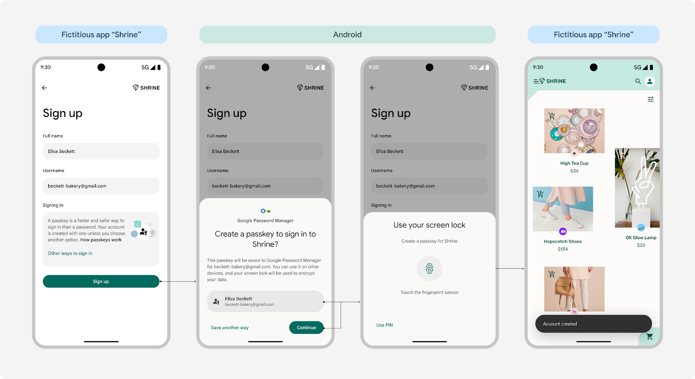

<h1 align="center">
React Native Credentials Manager 
</h1>



A React Native library that implements the [Credential Manager](https://developer.android.com/identity/sign-in/credential-manager) API for Android and [AuthenticationServices](https://developer.apple.com/documentation/authenticationservices) for iOS. This library allows you to manage passwords, passkeys and platform-specific sign-in (Google Sign-In on Android, Apple Sign In on iOS) in your React Native applications.

<p align="center">
  <a href="https://www.npmjs.com/package/react-native-credentials-manager">
    
  </a>
  <a title='License' href="https://github.com/benjamineruvieru/react-native-credentials-manager/blob/master/LICENSE" height="18">
    
  </a>
  <a title='Tweet' href="https://twitter.com/intent/tweet?text=Check%20out%20this%20awesome%20React%20Native%20Credentials%20Manager%20Library&url=https://github.com/benjamineruvieru/react-native-credentials-manager&via=benjamin_eru&hashtags=react,reactnative,opensource,github,ux" height="18">
    
  </a>
</p>

## Platform Support

- ✅ **Android**: Full implementation with Credential Manager API (Android 14+ / API 34+)
- ✅ **iOS**: Full implementation with AuthenticationServices (iOS 16.0+)

### Platform-Specific Features

| Feature                   | Android                   | iOS                               |
| ------------------------- | ------------------------- | --------------------------------- |
| Passkeys                  | ✅ Credential Manager API | ✅ AuthenticationServices         |
| AutoFill Password Support | ✅ Credential Manager API | ✅ AuthenticationServices         |
| Manual Password Storage   | ✅ Credential Manager API | ❌ Not supported (iOS limitation) |
| Third-party Sign In       | ✅ Google Sign In         | ✅ Apple Sign In                  |

> [!NOTE] > **iOS Implementation**: This library strictly follows Apple's Authentication Services framework. Manual password storage is not supported on iOS as it's not part of Apple's official Authentication Services APIs. Use AutoFill passwords instead.

> [!IMPORTANT]
> 📚 **Documentation has moved!** The complete documentation is now available at [https://docs.benjamineruvieru.com/docs/react-native-credentials-manager/](https://docs.benjamineruvieru.com/docs/react-native-credentials-manager/)

## Platform-Specific Parameters

When using this library, be aware that some parameters are platform-specific:

| Function               | Parameter                               | Platform Support | Notes                                                             |
| ---------------------- | --------------------------------------- | ---------------- | ----------------------------------------------------------------- |
| `signUpWithPasskeys()` | `preferImmediatelyAvailableCredentials` | Android only     | This parameter is ignored on iOS                                  |
| `signUpWithPassword()` | All parameters                          | Android only     | This function is not supported on iOS and will throw an error     |
| `signIn()`             | `googleSignIn`                          | Android only     | This parameter is ignored on iOS                                  |
| `signIn()`             | `appleSignIn`                           | iOS only         | This parameter is ignored on Android                              |
| `signUpWithGoogle()`   | All parameters                          | Cross-platform   | Uses Google Sign-In on Android, Apple Sign-In on iOS              |
| `signUpWithApple()`    | All parameters                          | iOS only         | This function is not supported on Android and will throw an error |

### Handling Platform Differences

To handle these platform differences, you can use conditional code:

```typescript
// For passkey registration
await signUpWithPasskeys(
  requestJson,
  Platform.OS === 'android' ? true : false // preferImmediatelyAvailableCredentials
);

// For sign-in
await signIn(
  [
    'passkeys',
    'password',
    Platform.OS === 'android' ? 'google-signin' : 'apple-signin',
  ],
  {
    passkeys: passkeyParams,
    ...(Platform.OS === 'android'
      ? { googleSignIn: { serverClientId: 'your-client-id' } }
      : { appleSignIn: { requestedScopes: ['fullName', 'email'] } }),
  }
);
```

## iOS Setup Requirements

### 1. Associated Domains

Add the Associated Domains capability to your iOS app:

1. In Xcode, select your project
2. Go to Signing & Capabilities
3. Add "Associated Domains" capability
4. Add your domain with the `webcredentials` service: `webcredentials:yourdomain.com`

### 2. Apple App Site Association (AASA)

Ensure your domain has a proper AASA file at `https://yourdomain.com/.well-known/apple-app-site-association`:

```json
{
  "webcredentials": {
    "apps": ["TEAMID.com.yourcompany.yourapp"]
  }
}
```

### 3. Apple Sign In Setup (Optional)

If using Apple Sign In, configure it in your Apple Developer account:

1. Enable "Sign In with Apple" capability in Xcode
2. Configure Sign In with Apple in your Apple Developer account
3. Add your app's bundle identifier to the Sign In with Apple configuration

## Quick Example

```typescript
import {
  signUpWithPasskeys,
  signUpWithPassword, // Android only - throws error on iOS
  signUpWithGoogle, // Cross-platform: Google on Android, Apple on iOS
  signUpWithApple, // iOS-specific function
  signIn,
  signOut,
  type Credential,
  type AppleCredential,
  type GoogleCredential,
  type AppleSignInParams,
  type GoogleSignInParams,
} from 'react-native-credentials-manager';

// Sign up with passkey (works on both platforms)
const passkeyResult = await signUpWithPasskeys({
  challenge: 'base64-challenge',
  rp: { name: 'Your App', id: 'yourdomain.com' },
  user: { id: 'user-id', name: 'username', displayName: 'User Name' },
  // ... other WebAuthn options
});

// Password handling - platform differences
try {
  // This will work on Android but throw an error on iOS
  await signUpWithPassword({ username: 'user', password: 'pass' });
} catch (error) {
  if (Platform.OS === 'ios') {
    console.log(
      'Manual password storage not supported on iOS. Use AutoFill instead.'
    );
  }
}

// Unified sign in (supports passkeys, AutoFill passwords, and platform sign-in)
const credential = await signIn(
  ['passkeys', 'password', 'google-signin'], // 'google-signin' becomes 'apple-signin' on iOS
  {
    passkeys: { challenge: 'base64-challenge', rpId: 'yourdomain.com' },
    googleSignIn: { serverClientId: 'your-client-id' },
  }
);

// Platform-specific sign-up methods
if (Platform.OS === 'ios') {
  // Direct Apple Sign In (iOS only) - uses AuthenticationServices
  const appleCredential = await signUpWithApple({
    requestedScopes: ['fullName', 'email'],
  });
} else {
  // Google Sign In (Android only)
  const googleCredential = await signUpWithGoogle({
    serverClientId: 'your-client-id',
  });
}

// Cross-platform sign-up (automatically uses the appropriate method)
const credential = await signUpWithGoogle({
  serverClientId: 'your-client-id', // Used on Android, ignored on iOS
});
// Returns GoogleCredential on Android, AppleCredential on iOS

// Handle different credential types
if (credential.type === 'passkey') {
  console.log('Passkey authentication:', credential.authenticationResponseJson);
} else if (credential.type === 'password') {
  console.log('AutoFill Password:', credential.username, credential.password);
} else if (credential.type === 'google-signin') {
  console.log('Google Sign In:', credential.idToken);
} else if (credential.type === 'apple-signin') {
  console.log('Apple Sign In:', credential.idToken, credential.email);
}
```

## Cross-Platform Compatibility

The library provides excellent cross-platform compatibility while respecting platform limitations:

- **`signUpWithGoogle()`**: Cross-platform function
  - Android: Uses Google Sign In
  - iOS: Automatically uses Apple Sign In (AuthenticationServices)
- **`signUpWithApple()`**: iOS-specific function
  - iOS: Uses Apple Sign In (AuthenticationServices)
  - Android: Rejects with clear error message
- **`signUpWithPassword()`**: Platform-specific behavior
  - Android: Uses Credential Manager API
  - iOS: Rejects (manual storage not supported by AuthenticationServices)
- **AutoFill Passwords**: Available on both platforms through `signIn` method
- **Error handling**: Platform-specific errors are handled gracefully

## iOS AuthenticationServices Integration

The iOS implementation strictly follows Apple's Authentication Services framework:

- **Passkeys**: `ASAuthorizationPlatformPublicKeyCredentialProvider`
- **AutoFill Passwords**: `ASAuthorizationPasswordProvider`
- **Apple Sign In**: `ASAuthorizationAppleIDProvider`
- **No Custom Keychain**: Manual credential storage is handled by the system

This ensures compliance with Apple's security guidelines and provides the best user experience on iOS.
